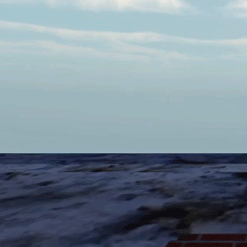
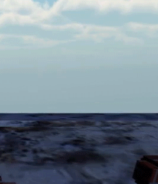
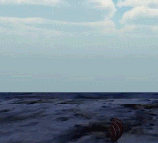

# GGPProj
2D Side Scrolling Running Game for Foundations of Game Graphics Programming

Part of the project goals was to implement a burst particle system. The particle system ended up having features such as speed, size, color, rotation over lifetime, and supported billboarding.

  
